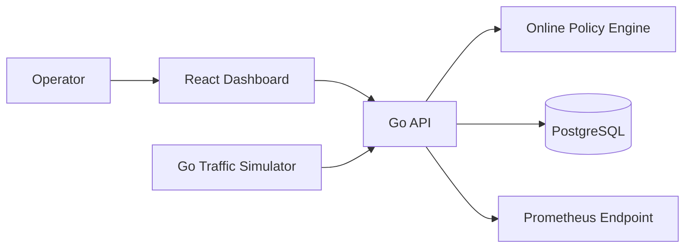
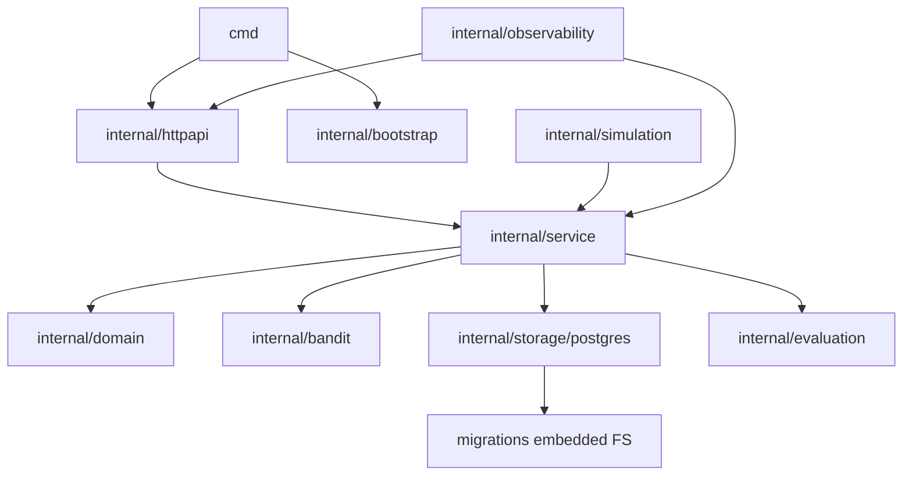

# Architecture

## Decision Summary

OfferPilot starts as a modular monolith. This keeps the first release understandable and testable while preserving package boundaries that could later become services if measured scale requires it.

## System Context

## Runtime Processes

### API Process

The API process owns HTTP transport, use-case orchestration, policy instances, persistence, simulation control for the dashboard, health checks, and metrics. Policy state is restored on startup and checkpointed after accepted feedback updates.

### Simulator Process

The optional simulator command is an external load generator that calls the public API. It is useful for repeatable benchmarks and testing the deployed HTTP boundary. The API also exposes controlled in-process simulation endpoints for the dashboard demo; both paths reuse the same simulation profiles and outcome model.

Only the in-process simulation manager can associate decisions with a persisted simulation run and contribute hidden random/oracle expectations. The public decision API cannot supply a simulation-run ID. The external simulator exercises decisions/outcomes but is intentionally excluded from dashboard benchmark attribution.

### Web Process

The Vite development server serves the React dashboard locally. A production container builds static assets and serves them separately from the Go API. The frontend contains no policy or reward business logic.

## Go Package Boundaries

Allowed dependency direction is downward in the diagram. `domain`, `bandit`, and `evaluation` must not import HTTP or PostgreSQL packages. The service package defines narrow storage interfaces at its consumption points.

## Decision Flow

1. The HTTP adapter validates shape and converts a request DTO to domain input.
2. The decision service loads the active experiment and eligible offers.
3. The service builds the canonical segment key from validated context.
4. The selected policy returns one offer, a full probability distribution, and its current version.
5. The service validates that probabilities are finite, non-negative, sum to one within tolerance, and include the selected action.
6. The decision and distribution are committed atomically.
7. The HTTP adapter returns the decision ID, offer, propensity, policy, and version.

## Feedback Flow

1. The HTTP adapter accepts an idempotency event ID, decision ID, and terminal outcome.
2. The feedback service derives the reward from the outcome.
3. PostgreSQL locks the experiment, atomically inserts the outcome only if the event and decision have no prior terminal outcome, and reserves the next consecutive policy version.
4. The service updates the in-memory policy exactly once at that reserved version after persistence accepts the event. The decision's older selection version is audit data and does not make delayed feedback stale.
5. The updated policy state is checkpointed at the reserved version. Even a non-learning random policy advances its application version so every accepted outcome remains recoverable and attributable.
6. Repeated delivery returns the original result without another policy update.

The MVP runs one API replica. Multi-replica policy coordination is explicitly deferred because exactly-once online updates require a stronger ownership protocol.

## Persistence Boundary

PostgreSQL is the system of record for configuration, decisions, feedback, policy snapshots, and simulation runs. In-memory policy state is a performance optimization and must be recoverable from the latest snapshot plus any unapplied accepted feedback identified by consecutive applied versions. Experiment creation persists the version-one snapshot in the same transaction as the experiment and offers.

## Concurrency Model

- HTTP requests are concurrent and cancellation-aware.
- Each experiment has one policy instance protected by the smallest practical lock.
- Selection may use a read lock; policy update and snapshot use an exclusive lock.
- Database transactions remain short and never include network calls.
- Simulation workers use a bounded worker pool and stop through context cancellation.
- On API startup, persisted `starting`, `running`, or `stopping` runs from a prior process are atomically marked `failed` with code `process_restarted` before readiness, preserving their partial counters.
- Tests run under the Go race detector.

## Failure Behavior

- Invalid context or candidate sets return a stable client error and do not create a decision.
- Database failure prevents a successful decision response.
- A persisted feedback event that cannot update policy marks the experiment unhealthy; recovery replays unapplied feedback before new decisions.
- Corrupt policy state fails closed to the random baseline only when the experiment configuration explicitly permits fallback, and emits a high-severity metric.
- The frontend treats API data as unavailable rather than inventing zero values.

## Deployment Shape

Local development uses Docker Compose with PostgreSQL, API, and web services. The first hosted deployment may use one API replica and one PostgreSQL instance. Kubernetes, distributed locks, Kafka, and autoscaling are roadmap concerns, not MVP dependencies.

## Why Not Microservices

The MVP needs transactional feedback semantics and coherent policy state more than independent scaling. Splitting services early would introduce message delivery, schema evolution, tracing, and consistency work without proving product value.
